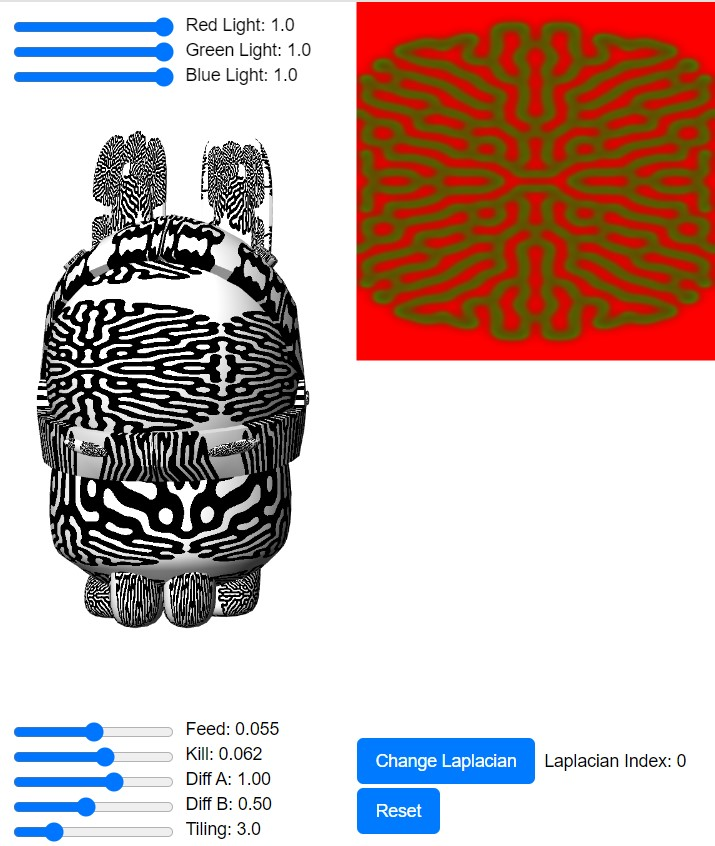
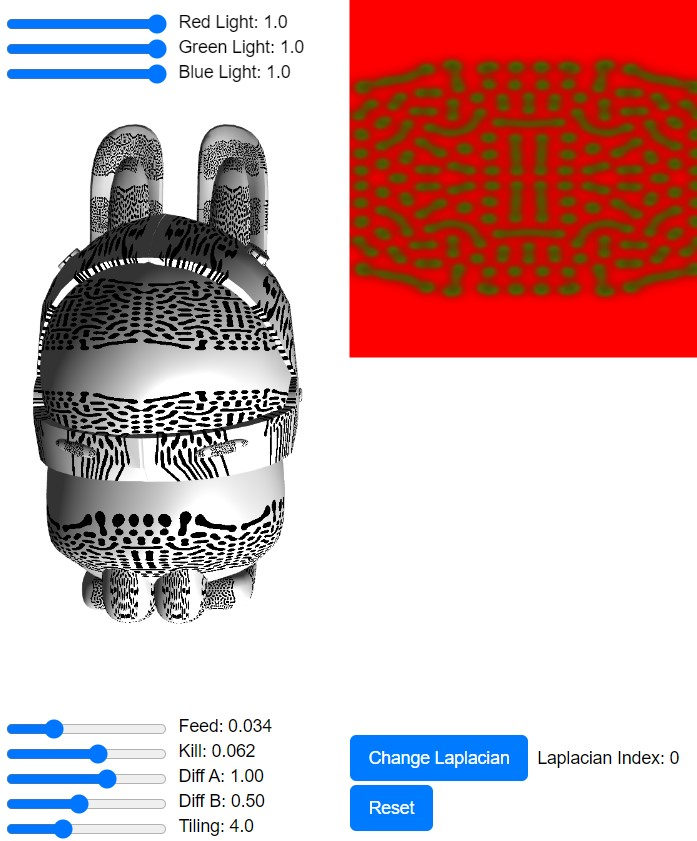
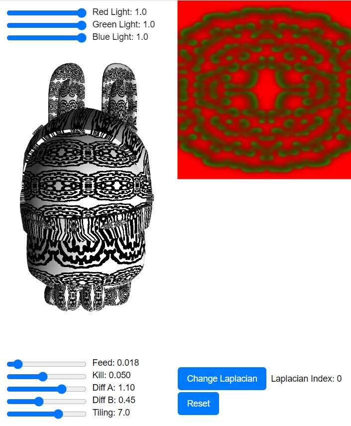
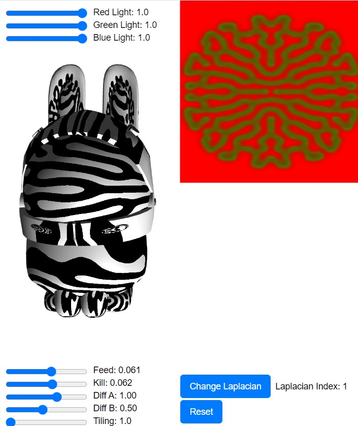
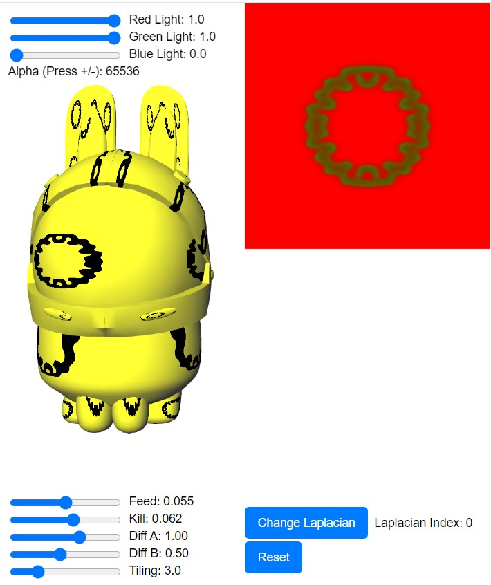
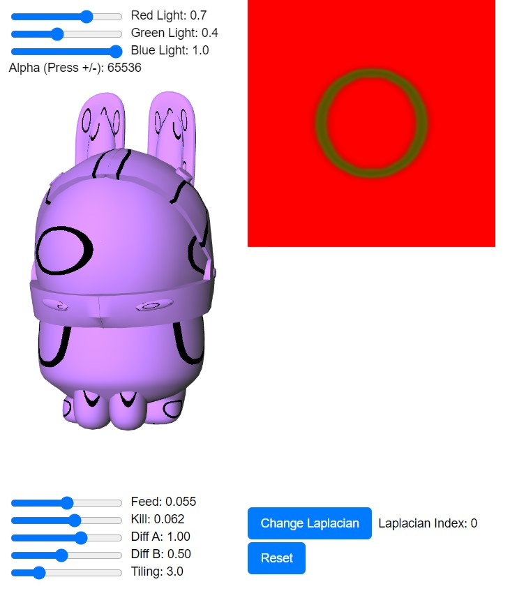

# Turing’s reaction-diffusion model

A p5 implementation of the Turing reaction-diffusion model with phong illumination (Shaders) on a previously created 3D model

## Team

- David Alfonso Cañas Palomino - Saturday Group
- Juan Sebastian Sarmiento Pulido - Saturday Group
- Esteban Lopez Barreto - Saturday Group
- Sergio Sanchez Moreno - Virtual Group

## Screenshots

### Default parameters

feed = 0.055;
kill = 0.062;
diffRateA = 1.0;
diffRateB = 0.5;

### Dots

feed = 0.034;
kill = 0.062;
diffRateA = 1.0;
diffRateB = 0.5;
tileFactor = 4.0;

### Flower

feed = 0.018;
kill = 0.05;
diffRateA = 1.1;
diffRateB = 0.45;
tileFactor = 7.0;

### Zebra stripes

feed = 0.061;
kill = 0.062;
diffRateA = 1.0;
diffRateB = 0.5;
tileFactor = 1.0;

### Change light color

## How to run

We use a local minified copy of p5.js, but due to the spritesheet and CORS you cannot just open the index.html file, it needs to be served through http, we suggest running `python -m http.server 8888` in the code root folder. Or you can visit the slightly adapted version we uploaded to the p5 web editor [here](https://editor.p5js.org/jsarmientopu/full/jvvpOsLyl)

## Program Structure

Some notes relevant to the implementation and program structure

- The effect was created over a shader that affects a texture (p5.Framebuffer).
- WThe texture is applied one or more times (Tiling parameter) over the 3D model.
- Another shader is responsable for the phong ilumination `phongShader`.

## References

- We based on https://www.karlsims.com/rd.html
